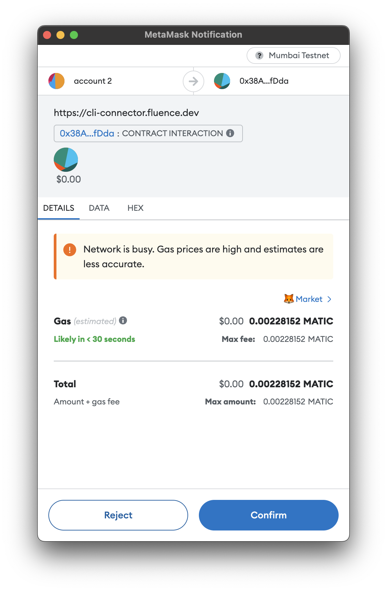

# Hacking Decentralized RPC with Fluence

## Overview

Running blockchain nodes to support your dApps' read and write requirements to/from a node tends to be rather resource intensive. Not surprisingly, Web3 developers have been flocking toward integrating their dApps with hosted blockchain JSON-RPC gateways. Alas, centralized "RPC as SaaS" introduces bottlenecks challenging the availability, reliability and Web3 ethos of dApps while quite often raising the exit barriers by providing custom API overlays to the EVM JSON-RPC API convention.

To accelerate dApp developers' ability to utilize decentralized RPC in their dApps, Fluence is providing a decentralized RPC (fRPC) substrate, i.e., a starter kit that includes a gateway to bridge HTTP and Aqua, a Wasm service to connect to RPC endpoints and Aqua scripts implementing basic availability, failover and verification algorithms. See Figure 1.

Figure 1: Stylized fRPC Workflow With dApp


fRPC substrate allows existing dApps to be upgraded to decentralized RPC while not requiring any changes to their frontend other than changing the HTTP transport url and making it easy to implement more complex control algorithms. Moreover, fRPC substrate components are highly customizable allowing developers to quickly and easily extend the substrate to fit their dApps' needs and to improve the fRPC ecosystem with improved services and algorithms.

## Quickstart

Clone the repo if you haven't done so already, and in the *gateway* directory, install the dependencies:

```bash
npm i
```

If you don't have Fluence CLI installed, do:

```bash
npm -g i @fluencelabs/cli@unstable
```

Before you proceed, you should have, say, three RPC endpoint urls, e.g., Infura, Alchemy and Ankr, for the same EVM-based chain you are using in your dApp. Update the `configs/quickstart_config.json` by providing your endpoint urls and ignore the rest of the parameters for now:

```json
{
  "providers": [
    "<replace with your url_1/api-key>",   // <- replace
    "<replace with your url_2/api-key>",   // <- replace
    "<replace with your url_3/api-key>"    // <- replace and maybe add more
  ],
  "mode": "round-robin",
  "relay": "/dns4/stage.fluence.dev/tcp/19002/wss/p2p/12D3KooWMigkP4jkVyufq5JnDJL6nXvyjeaDNpRfEZqQhsG3sYCU",
  "serviceId": "e9e32b0b-3b19-4bdd-b1da-f5ff9cc0357f",
  "port": 3000,
  "counterServiceId": null,
  "counterPeerId": null,
  "quorumServiceId": null,
  "quorumPeerId": null,
  "quorumNumber": null
}
```

Now start the gateway:

**Command**:

```bash
npm -C gateway run run configs/quickstart_config.json
```

**Output**:

```bash
> @fluencelabs/aqua-eth-gateway@0.0.11 run
> fluence aqua -i aqua/ -o aqua-compiled/ --js && node src/index.js configs/my_quickstart_config.json

# Compiling...
Result /Users/bebo/localdev/fRPC-Substrate/gateway/aqua-compiled/rpc.js: compilation OK (10 functions, 4 services)
Result /Users/bebo/localdev/fRPC-Substrate/gateway/aqua-compiled/rpc.d.ts: compilation OK (10 functions, 4 services)
Result /Users/bebo/localdev/fRPC-Substrate/gateway/aqua-compiled/rpc.js: compilation OK (10 functions, 4 services)
Result /Users/bebo/localdev/fRPC-Substrate/gateway/aqua-compiled/rpc.d.ts: compilation OK (10 functions, 4 services)

Running server...
Server was started on port 3000

```

With the gateway ready for action, all you have to do is change your dApps HTTP transport url to `http://127.0.0.1:3000` and keep using your dApp as usual. In the absence of a dApp, we can interact with the gateway from the command line:

**Command**:

```bash
curl http://127.0.0.1:3000  \
    -X POST \
    -H "Content-Type: application/json" \
    -d '{"jsonrpc":"2.0","method":"eth_blockNumber","params": [],"id":100}'
```

**Output**:

```bash
{"jsonrpc":"2.0","id":100,"result":"0x82b950"}

# with the corresponding gateway log output
Receiving request 'eth_blockNumber'
peerId: 12D3KooWKDnWpCLPJrycSevracdEgGznfDPwG1g5CWbt8uccdL79
Counter: 1
Worker used: "12D3KooWKPcNwR6EMq3sqm4sKtUKmZbMhPQ2dk1zr8YNgjdu9Xqn"
Call will be to : https://eth-goerli.g.alchemy.com/v2/<your api key>
```

Since we have specified *round-robin* in our config file and have more than one endpoint url in play, re-running the json-rpc call should result in a different endpoint selection:

**Command**:

```bash
curl http://127.0.0.1:3000  \
    -X POST \
    -H "Content-Type: application/json" \
    -d '{"jsonrpc":"2.0","method":"eth_blockNumber","params": [],"id":100}'
```

**Output**:

```bash
{"jsonrpc":"2.0","id":100,"result":"0x82b956"}

# with the corresponding gateway log output

Receiving request 'eth_blockNumber'
peerId: 12D3KooWKDnWpCLPJrycSevracdEgGznfDPwG1g5CWbt8uccdL79
Counter: 2
Worker used: "12D3KooWKPcNwR6EMq3sqm4sKtUKmZbMhPQ2dk1zr8YNgjdu9Xqn"
Call will be to : https://frequent-sleek-river.ethereum-goerli.discover.quiknode.pro/<your api key>/
```

Success! Go ahead and replace the `round-robin` mode with the `random` mode in your config file, stop and start the gateway and have a look at the different endpoint management. All available algorithms and their parameters are described in the [fRPC Algorithms](#fRPC-Algorithms) section below.

Congrats, you just took a major step toward keeping your dApp decentralized, available and performant! Now it's time to dive into the Fluence protocol and technology stack to learn how to improve upon the basic substrate.

## Developing With Fluence

Fluence's decentralized serverless protocol and solution stack allows developers to quickly create decentralized applications and protocols by distributing services for subsequent execution to peers of the open and permissionless Fluence peer-to-peer compute network. Specifically, developers:

* express their business logic in Rust code compiled to wasm32-wasi
* create a [Deal](https://fluence.dev/docs/build/glossary#deal), i.e., a construct that links on-chain contract economics and off-chain resources necessary for peers to run a service, which entails escrowing stablecoin, currently limited to (testnet) USDC, to the Deal contract
* deploy their Wasm modules plus linking instructions as a uniquely addressable *service* to p2p network storage, i.e., IPFS

With a Deal in place, resource owners, i.e., owner/operators of one or more peers, make a decision whether to host the service and if so, participate in the Deal by providing a stake to the Deal contract and pulling the corresponding service assets required for hosting from IPFS. As a matter of fact, peers utilize [Workers](https://fluence.dev/docs/build/glossary#worker), omitted from Figure 2 for simplicity reasons, to implement their side of a Deal. See Figure 2.


While this sounds, and is, elaborate, *Fluence CLI*, see below, takes care of most of the scaffolding and workflow management for you.

> At this point, the marketplace for Fluence's decentralized serverless isn't quite finished. The supply side has not been enabled and on the demand side, parameters are fixed for the testnet. That is, developers are not able to provide custom Deal parameters, such as willingness to pay for service execution. Instead, these parameters, i.e. price of execution per epoch and epoch duration, are hard-coded and used by Fluence CLI to create the corresponding Deal contract and transaction for you to sign. Moreover, economics are limited to the testnet using testnet tokens.

## Setting Up For Developing With Fluence

To get going, you need to install and set up a few dependencies.

> Fluence tooling works on most \*nix systems including OSX and Windows Linux Subsystem. At this time, Windows is not supported.

### Off-chain Dependencies

* [node](https://nodejs.org/en/) 18 LTS
* [Fluence CLI](https://github.com/fluencelabs/fluence-cli)
* [Rust](https://www.rust-lang.org/tools/install) (optional; Fluence CLI will install if not already in your environment)
* For VSCode, there is a helpful [Aqua language support](https://marketplace.visualstudio.com/items?itemName=FluenceLabs.aqua) package available

> This Fluence CLI installs missing dependencies as needed ("lazy install"). If you want all your dependencies installed at once, use the `fluence dependencies i` command.

### On-chain Dependencies

* Wallectconnect compatible wallet, e.g., MetaMask, set for and funded with:
  * [Mumbai testnet](https://chainlist.org/chain/80001) parameters
  * [Mumbai faucet](https://mumbaifaucet.com/)
  * [Fluence USDC testnet faucet](https://faucet.fluence.dev/)

You will need Mumbai MATIC and Fluence (testnet) USDC. This is as good a time as any to head over to those faucets and get your allocations. As an experienced Web3 dev, you know it's good hygiene to set up a new account, say, fRPC-dev, for the Mumbai testnet and testnet tokens.

### RPC Endpoints

Since fRPC works with existing centralized or self-hosted RPC providers, you want at least three provider urls with appended API keys to *the* chain of your choice. Multi-chain support is currently not supported by fRPC Substrate. For Ethereum's Goerli testnet, for example:

* Infura: https://goerli.infura.io/v3/\<your key>/
* Alchemy: https://eth-goerli.g.alchemy.com/v2/\<your key>/
* Ankr: https://rpc.ankr.com/eth_goerli/\<your key>

Each of the listed providers has a free account option and supports the API key in the url style, rather than the header, which is the current gateway implementation choice; a choice you should feel free to override and customize to your needs.

### Tools And Tooling

The most prominent developer's helper is [Fluence CLI](https://github.com/fluencelabs/fluence-cli), which allows you to manage the entire lifecycle of a project including Rust and Aqua code as well as Deals. From scaffolding your project, services and modules to Deal creation and service deployment, Fluence CLI has you covered. Moreover, Fluence CLI can scaffold JS projects using [js-client](https://github.com/fluencelabs/js-client) allowing you to create, or integrate, Fluence projects for the browser or node app. See Figure 3 for a quick overview of workflows managed by Fluence CLI and the associated commands. If you have Fluence CLI installed, use `fluence --help` to get a more complete overview of topics and commands.

Figure 3: Stylized Project Creation And Deployment Workflow With Fluence CLI


Fluence CLI uses multiple *yaml* config files. You can find the schemas in the [schemas](./.fluence/schemas) directory. Note that Fluence CLI creates config files lazily, i.e., as needed.

See [FLuence CLI](https://github.com/fluencelabs/fluence-cli) for more details. For implementing your business logic with Rust and compiling it to wasm32-wasi, aka Wasm, module(s), see the [Marine book](https://fluence.dev/docs/marine-book/introduction). To learn more about distributed choreography and composition of services, see the [Aqua book](https://fluence.dev/docs/aqua-book/introduction).

## Hacking On fRPC Substrate

Fluence's *fRPC Substrate* is a starter kit that includes all the components you need to quickly enable your dApp with decentralized RPC using existing centralized RPC providers, e.g., Infura, Alchemy, Ankr, etc., without touching your existing frontend Web3 code. fRPC substrate consists of the following code components, see Figure 4:

* RPC API "adapter" code written in Rust and compiled to wasm32-wasi modules that are deployable to any peer in the Fluence p2p network
* Aqua code for distributed algorithms, such as Random and Round Robin selection, using the distributed Wasm connectors for request-response handling over libp2p
* A gateway app server that bridges libp2p transport to the HTTP transport expected by your dApps' Web3 SDK, such as web3js, ethers, etc. Note that the expectation at this point is for you to *self-host* the gateway at a location of your choosing.

Figure 4: Stylized fRPC Use With dApps


### fRPC Wasm Components

fRPC Substrate comes with one *service* comprised of two Wasm modules, which you can find in the [wasm-modules]("./wasm-modules/") directory. The service is called 'eth_rpc' and the included modules are a [curl_adapater]("./../wasm-modules/curl-adapter") and [eth_rpc]("./../wasm-modules/eth-rpc"). The *curl_adapter* module is a generic, re-usable module allowing access to a peer's curl binary, if permissioned by the peer, and exposes the *curl_request* function. Any modules requiring curl access may use the curl_adapter modules via [FFI linking](https://doc.rust-lang.org/nomicon/ffi.html) with the *curl_request* function.

The *eth_rpc* module manages the json-rpc requests and responses initiated and consumed by Aqua scripts as the result of some frontend event, e.g. our dApp or curl request. Once available on peers of the Fluence p2p network, the *eth-rpc* services, aka RPC endpoint adapter, allows us to call one or more RPC endpoints using Aqua for choreography and composition of services.

Before you can deploy your service, use `fluence build` in the root dir to compile each module's Rust code to wasm32-wasi output:

**Command**:

```bash
fluence build
```

**Output**:

```bash
# Making sure all services are downloaded...
# Making sure all services are built...
    Finished release [optimized] target(s) in 0.61s
```

See [target dir]("./target/wasm32-wasi/release") for *curl_adapter.wasm* and *eth_erpc.wasm*, respectively. With the wasm modules available, you can locally interact with them using [Marine REPL](https://crates.io/crates/mrepl):

`fluence service repl`

**Command**:

```bash
fluence service repl
```

**Output**:

```bash
? Enter service name from fluence.yaml, path to a service or url to .tar.gz archive wasm-modules
# Making sure service and modules are downloaded and built...
    Finished release [optimized] target(s) in 0.18s

^^^^^^^^^^^^^^^^^^^^^^^^^^^^^^^^^^^^^^^^^^^^^^^^^^^^^^^^^^^^^^^^^^^^^^^^^^^^^^^^

Execute help inside repl to see available commands.
Current service <module_name> is: eth_rpc
Call eth_rpc service functions in repl like this:

call eth_rpc <function_name> [<arg1>, <arg2>]

^^^^^^^^^^^^^^^^^^^^^^^^^^^^^^^^^^^^^^^^^^^^^^^^^^^^^^^^^^^^^^^^^^^^^^^^^^^^^^^^

Welcome to the Marine REPL (version 0.19.1)
Minimal supported versions
  sdk: 0.6.0
  interface-types: 0.20.0

app service was created with service id = f0fc66d9-1fc6-494f-bcc1-104970875730
elapsed time 254.67135ms

1> i
Loaded modules interface:
exported data types (combined from all modules):
data MountedBinaryResult:
  ret_code: i32
  error: string
  stdout: []u8
  stderr: []u8
data U64Value:
  value: u64
  success: bool
  error: string
data BytesValue:
  value: []u8
  success: bool
  error: string
data JsonString:
  value: string
  success: bool
  error: string

exported functions:
curl_adapter:
  func curl_request(cmd: []string) -> MountedBinaryResult
eth_rpc:
  func block_number(uri: string) -> U64Value
  func call_get_accounts(uri: string) -> [][]u8
  func accounts(uri: string) -> []JsonString
  func call(uri: string, req: string, block: u64) -> BytesValue
  func eth_call(uri: string, method: string, json_args: []string) -> JsonString

2>call eth_rpc eth_call ["https://<your network>.infura.io/v3/<your api key>", "eth_blockNumber", []]
result: {
  "error": "",
  "success": true,
  "value": "\"0x82a08d\""
}
 elapsed time: 588.092888ms

3>
```

The *i* command lists all the exported interfaces from the wasm modules in Aqua instead of Rust notation. In *exported* functions you see the module namespace, e.g., *curl_adapter*, and exported functions, e.g., *curl_request*. To execute a function, use `call <namespace> <function name> [<parameters>]`.

### Adding Modules To A Service

Regardless of your customization requirements, you probably will have no reason to modify the *curl_adapter* and *eth_rpc* modules. However, you may want to add new modules, or even services, to handle your additional business logic requirements. For example, you may want to capture RPC endpoint performance data, such as response times and availability, to some Web3 storage, e.g., IPFS or Ceramic, for further analysis to, say, derive a weighting scheme for endpoint selection.

Fluence CLI allows you to quickly create a new, or add an existing, module to your project. For example,

**Command**:

```bash
fluence module new --path ./wasm-modules demo-module
```

**Output**:

```bash
Successfully generated template for new module at demo-module
```

Which created a Rust project in the *wasm-module/demo-module* directory ready for you to customize. When you're done, you add the new module to your service config, service.yaml:

**Command**:

```bash
fluence module add
```

**Output**:

```bash
? Enter path to a module or url to .tar.gz archive wasm-modules/demo
? Enter service name from fluence.yaml or path to the service directory wasm-modules
Added demo to ~/localdev/fRPC-Substrate/wasm-modules/service.yaml
```

The demo module is now part of the service and `fluence build`, for example, now compiles the *demo* module as part of the project build. You can create a new service with the `fluence service new` command. Note that the implication of creating a new service, possibly in a new project directory, is that you intend to deploy that service separately from the *eth-rpc* service. Of course, you will need to write Aqua code to be able to interact with your new module.

To get rid of the demo project for now, use `fluence module remove` to unlink the module from the *fluence.yaml* and *service.yaml* files; the old *rm -r <path/demo>* gets rid of the code template.

### Deploying Services With A Deal

> :warning: **Warning**: For quickstart, services are already deployed for you. But if you want to deploy services in this repository yourself, you should remove old deployment information first:
> ```bash
> mv .fluence/workers.yaml .fluence/workers.yaml.backup
> ```
> `fluence deal deploy` is capable of redeploying services, so you don't have to do this manual management every time you want to (re)deploy deal. But one can't redeploy a deal he doesn't own, so you will get a error unless you are working to modify a Deal you created.


With a service, in this case the *eth-rpc* service, ready for deployment, we simply use the `fluence deal deploy`:

**Command**:

```bash
fluence deal deploy
```

**Output**:

```bash
Using kras environment to sign contracts
    Finished release [optimized] target(s) in 0.05s # (1)
Connecting to kras relay: /dns4/7-kras.fluence.dev/tcp/9000/wss/p2p/12D3KooWDUszU2NeWyUVjCXhGEt1MoZrhvdmaQQwtZUriuGN1jTr
Connected

Creating deal for worker defaultWorker # (2)

To approve transactions to your wallet using metamask, open the following url: # (3)

https://cli-connector.fluence.dev/?wc=3df74b36a4459be644172d82e114297a65330ada4e77bc8afba67688064f033e%402&relay-protocol=irn&symKey=5b9b1773203cfe98c86bb8d611ff7945173430f5fb056fcd95f79919adbb0bae

or go to https://cli-connector.fluence.dev and enter the following connection string there:

wc:3df74b36a4459be644172d82e114297a65330ada4e77bc8afba67688064f033e@2?relay-protocol=irn&symKey=5b9b1773203cfe98c86bb8d611ff7945173430f5fb056fcd95f79919adbb0bae

Confirm transaction in your wallet...
# Waiting for transaction to be mined......
To approve transactions to your wallet using metamask, open the following url: # (4)

https://cli-connector.fluence.dev/?wc=4c6084bf73667a0f02795048002dfdaff8e6b1be22495f989e6d04995ad2e8ba%402&relay-protocol=irn&symKey=8b19aba8c445bd37819f60ef0bafe2e4098424dc5d570a8dfeaf4b57cc1e794d

or go to https://cli-connector.fluence.dev and enter the following connection string there:

wc:4c6084bf73667a0f02795048002dfdaff8e6b1be22495f989e6d04995ad2e8ba@2?relay-protocol=irn&symKey=8b19aba8c445bd37819f60ef0bafe2e4098424dc5d570a8dfeaf4b57cc1e794d

Confirm transaction in your wallet...
# Waiting for transaction to be mined......
3 workers joined the deal 0x06AAe83F938890c47FA7C667392e01D9E3052961 # (5)


Success!

created deals: # (6)
  defaultWorker:
    deal: https://mumbai.polygonscan.com/address/0x06AAe83F938890c47FA7C667392e01D9E3052961
    worker definition: bafkreigzfyfis2pmfr425dwpeql4hsrat5d7hpdthlxwzhefd23kw7gtey
    timestamp: 2023-10-12T14:39:21.570Z
```

One little command is doing quite a bit so you don't have to. Let's work through the process:

* for an up-to-date look, all service assets, i.e., modules, are (re-) compiled (1)
* a (new) Deal with both on-chain and off-chain activities is created (2)
  * the wasm modules and config are uploaded to IPFS node where deal-participating peer's workers can fetch the package by CID
* now you have to get involved! You are presented with two transactions, one after the other, for you to sign. To sign a transaction, copy and paste the uri to your browser and Metamask should pop up with a signing request eventually. Before signing a transaction, carefully inspect its origin and content. Different wallets have different security features. If you are using MetaMask, carefully review your Security & Privacy settings. This is what you should see when you sign a transaction:

  * first transaction is for the Deal on-chain creation (3)
  * second transaction is for the Deal's on-chain matching (4)
* once you sign the transactions, the deal is created and workers join the deal, deploying your services (5)
* finally, deployment information is saved for future use in Aqua scripts (6)

Fluence CLI did a bunch of work for us behind the scenes and signing the transaction is a lot quicker than entering (virtual) credit card information. Fluence CLI organized a set of parameters needed by our Aqua scripts in [deals.aqua](./.fluence/aqua/deals.aqua) for easy importing.

Note that the deal's section in [fluence.yaml](./fluence.yaml) specifies the minimum and maximum workers that should be deployed under the *defaultWorker* namespace. Fluence CLI currently provides default values for min and max workers of one (1) and three (3), respectively. In the near future, you will be able to provide your spot price for service execution, hosting targets in the form of named capacity providers and more.

### fRPC Aqua Code

Now that we have our services deployed and ready for action, it's time to look at Aqua, which is utilized by the Gateway to bridge HTTP to/from libp2p. Let's have a look at the Aqua code and structure.

[rpc.aqua]("./gateway/aqua/rpc.aqua") contains the necessary dependencies and algorithms.

```aqua
-- rpc.aqua
import "@fluencelabs/aqua-lib/builtin.aqua"
import "deals.aqua"
import "services.aqua"
import "@fluencelabs/registry/subnetwork.aqua"
import Registry, Record from "@fluencelabs/registry/registry-service.aqua"
import "@fluencelabs/spell/spell_service.aqua"
```

Two of the dependencies (should) stand out: *deals.aqua* and *services.aqua* as they are local files located in the project *.fluence* directory: *services.aqua* contains the interface exports from the *eth-rpc* wasm module and  *deals.aqua* maps the values from *deployed.yaml* to data structures usable by your aqua code. Since these files are dynamically generated by Fluence CLI, you need to (re-) compile your Aqua after every change to your Wasm code or deal deploy updates. For all things Aqua refer to the [Aqua book](https://fluence.dev/docs/aqua-book/introduction), the [aqua playground](https://github.com/fluencelabs/aqua-playground) and the respective repos: [aqua-lib](https://github.com/fluencelabs/aqua-lib), [registry](https://github.com/fluencelabs/registry), [spell](https://github.com/fluencelabs/spell).

### fRPC Gateway Configuration

The gateway config file, e.g., [quickstart_config.json](./configs/quickstart_config.json), contains the parameters necessary for the gateway to connect to the Fluence p2p network and to configure the gateway's behavior. The gateway config file is a json file with the following parameters:

* *providers*: an array of RPC endpoint urls, e.g., Infura, Alchemy, Ankr, etc.
* *mode*: one of "random", "round-robin" or "quorum" to specify the endpoint selection algorithm
* *relay*: the Fluence p2p network relay address for [js-client](https://github.com/fluencelabs/js-client) to use
* *port*: the port the gateway listens on
* other parameters related to the fRPC Algorithms, see below

### fRPC Algorithms

The fRPC substrate comes with basic implementations of several algorithms useful in mitigating failure as the result of availability and lack of trustlessness with respect to RPC endpoints and possibly peers.

#### Random

**Use: Set `mode` to "random" in your gateway config file**

Randomization the selection of one out of many RPC endpoints by itself is a weak algorithm to mitigate a single point of failure or byzantine behavior. However, it can be an important building block for more effective algorithms such as failover and quorum/consensus from both RPC providers and network peers.

The fRPC substrate implementation is very basic from a business logic perspective but illustrates how to randomly choose both a worker, which represents the deployed service on a particular peer, and an RPC endpoint:

```python
func randomLoadBalancing(uris: []string, method: string, jsonArgs: []string, callFunc: string, string, []string -> JsonString) -> JsonString:
  on HOST_PEER_ID:                                                                  --< 1
    workers <- getWorkers()                                                         --< 2
    workersNum = workers.length
    -- choose worker randomly
    timeW <- NumOp.identity(Peer.timestamp_sec())
    workerNumber = timeW % workers.length                                           --< 3
    worker = workers[workerNumber]
    -- choose provider randomly
    timeP <- NumOp.identity(Peer.timestamp_sec())
    providerNumber = timeP % uris.length                                            --< 5
    provider = uris[providerNumber]
    result <- callOnWorker(worker, provider, method, jsonArgs, callFunc)            --< 6
  Logger.logWorker(worker)                                                          --< 7
  Logger.logCall(uris[providerNumber])
  <- result
```

We want to execute our Aqua program on the peer of the client, i.e. the gateway's client peer, connected to (1). To set up our randomized worker and endpoint selection, we need to get the workers running our eth-rpc service (2). We then calculate the index *workerNumber* as a random integer (3) and do the same for the endpoint provider (5). Finally, we call the chosen worker with the chosen endpoint url (6) and print our randomly chosen integers to the screen (7) before returning the result.

#### Round robin

**Use: Set `mode` to "round-robin" in your gateway config file**

[Config Parameters](#fRPC-Gateway-Configuration):
* *counterServiceId*: the service id of the counter service
* *counterPeerId*: the peer id of the counter service

```aqua
func roundRobin(uris: []string, method: string, jsonArgs: []string, counterServiceId: string, counterPeerId: string, callFunc: string, string, []string -> JsonString) -> JsonString:
  on counterPeerId:                                                           --< 1
    Counter counterServiceId
    requestNumber <- Counter.incrementAndReturn()
  on HOST_PEER_ID:                                                            --< 2
    workers <- getWorkers()
    workerNumber = requestNumber % workers.length
    worker = workers[workerNumber]                                            --< 3
    providerNumber = requestNumber % uris.length
    provider = uris[providerNumber]                                           --< 4
    result <- callOnWorker(worker, provider, method, jsonArgs, callFunc)      --< 5
  Logger.logWorker(worker)
  Logger.logCall(uris[providerNumber])
  <- result
```

A round robin algorithm cycles through the different options usually in a predictable manner.  This substrate implementation is no different. To keep the state of the *cycle index*, we use a counter based on a local, [js-client](https://github.com/fluencelabs/js-client) based service [implementation]("./gateway/src/index.js) (1). Here, the peer executing the *Counter* service is the (local) client-peer implemented by the gateway. Note that the state of the counter is limited to the life of the gateway. With the incremented counter in place, we had to our relay (2), determine our worker (3) and provider (4) indexes, call for the service execution (5), log and return the result.

#### Quorum

**Use: Set `mode` to "quorum" in your gateway config file**

[Config Parameters](#fRPC-Gateway-Configuration):
* *quorumServiceId*: the service id of the quorum service
* *quorumPeerId*: the peer id of the quorum service
* *quorumNumber*: the number of results that must be equal to determine a quorum result

```aqua
func quorum(
  uris: []string, quorumNumber: u32, timeout: u32, method: string, jsonArgs: []string, quorumServiceId: string, quorumPeerId: string,
  callFunc: string, string, []string -> JsonString
) -> QuorumResult:
  results: *JsonString
  on HOST_PEER_ID:
    workers <- getWorkers()
    for worker <- workers par:                                        --< 1
      on worker.metadata.peer_id via worker.metadata.relay_id:
        -- choose provider randomly
        timeP <- NumOp.identity(Peer.timestamp_ms())
        providerNumber = timeP % uris.length
        provider = uris[providerNumber]
        results <- callFunc(provider, method, jsonArgs)               --< 2
    -- wait all results from all workers with timeout
    join results[workers.length - 1]
    par Peer.timeout(timeout, "")                                     --< 3
  on quorumPeerId via HOST_PEER_ID:
    Counter quorumServiceId
    -- check all results that we got
    quorumResult <- QuorumChecker.check(results, quorumNumber)        --< 4
  <- quorumResult
```

A quorum, aka "off-chain consensus", "determines" a result by a ranked frequency distribution of the results pool and makes a selection against a quorum threshold value, e.g., 2/3 of items in the results pool must be equal for a quorum result to be accepted. Moreover, additional parameters such as the minimum number of items in the result pool may be added. Depending on your trust in the peers processing the endpoint requests or even the peer executing the quorum algorithm, additional verification steps may have to be added. There is one more pertinent consideration when it comes to designing quorum algorithms: the differentiation between (on-chain) read and write operations.

In the fRPC substrate implementation, we provide a basic quorum algo that polls each endpoint in parallel (1) and captures the results in a stream variable (2) and binds the loop with a timeout condition (3) running in parallel to (1). See the [Aqua book](https://fluence.dev/docs/aqua-book/language/flow/parallel#timeout-and-race-patterns) for more details. Finally, we check the results and return the result (4). As evidenced by the code, no considerations to differentiate between read and write operations are made, which might prove disadvantageous when submitting, for example, a signed transaction.

## Summary

fRPC is a design pattern to efficiently mitigate risks inherent in centralized RPC providers for dApps using Fluence's decentralized serverless compute protocol. fRPC Substrate is a basic implementation of the fRPC design pattern that dApp users can use out of the box with no changes to their frontend. Once you tried fRPC, feel free to experiment with the code and let us know about your journey in the [Fluence Discord](https://fluence.chat) developer channel.

For support, to discuss your ideas or to schedule presentations of your solutions to the Fluence and fRPC community at large, reach out in [discord]("https://fluence.chat") or [telegram](https://t.me/fluence_project).

Happy Hacking!

## Contribution

Found a mistake, inaccuracy or have other improvement suggestions? Open an issue or a pull request! Note that contributions submitted will be licensed according to the terms of [LICENSE](./LICENSE).
