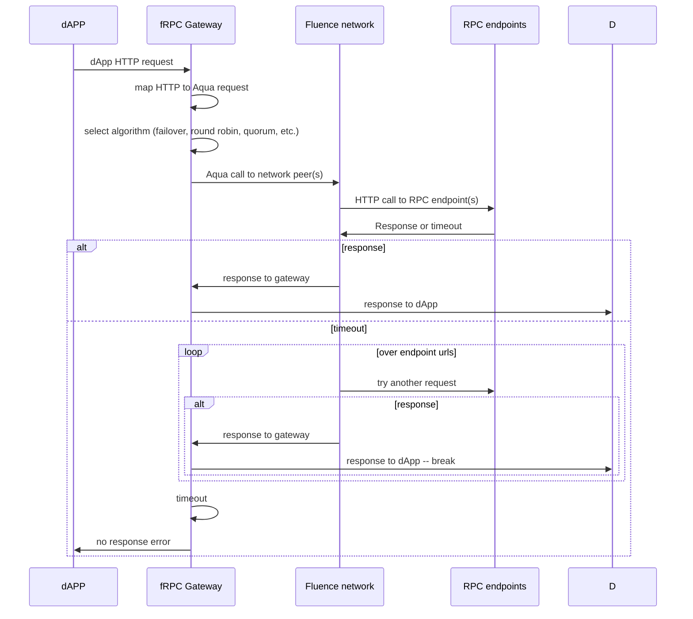
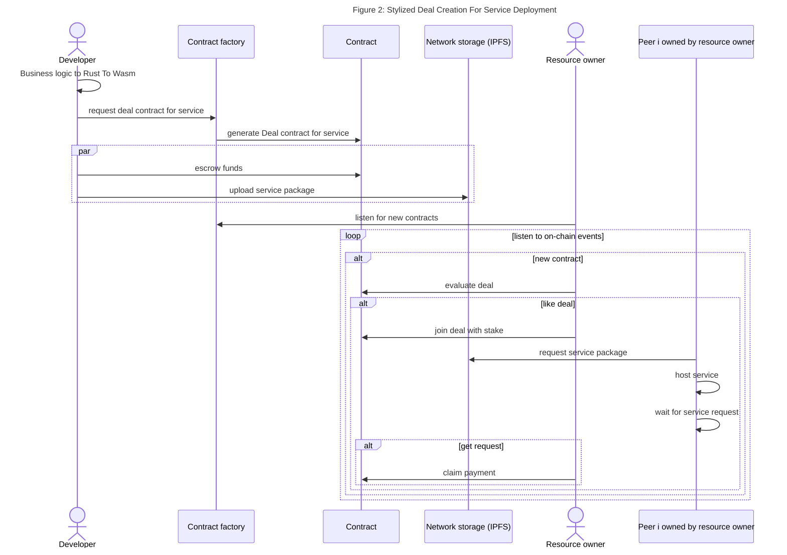
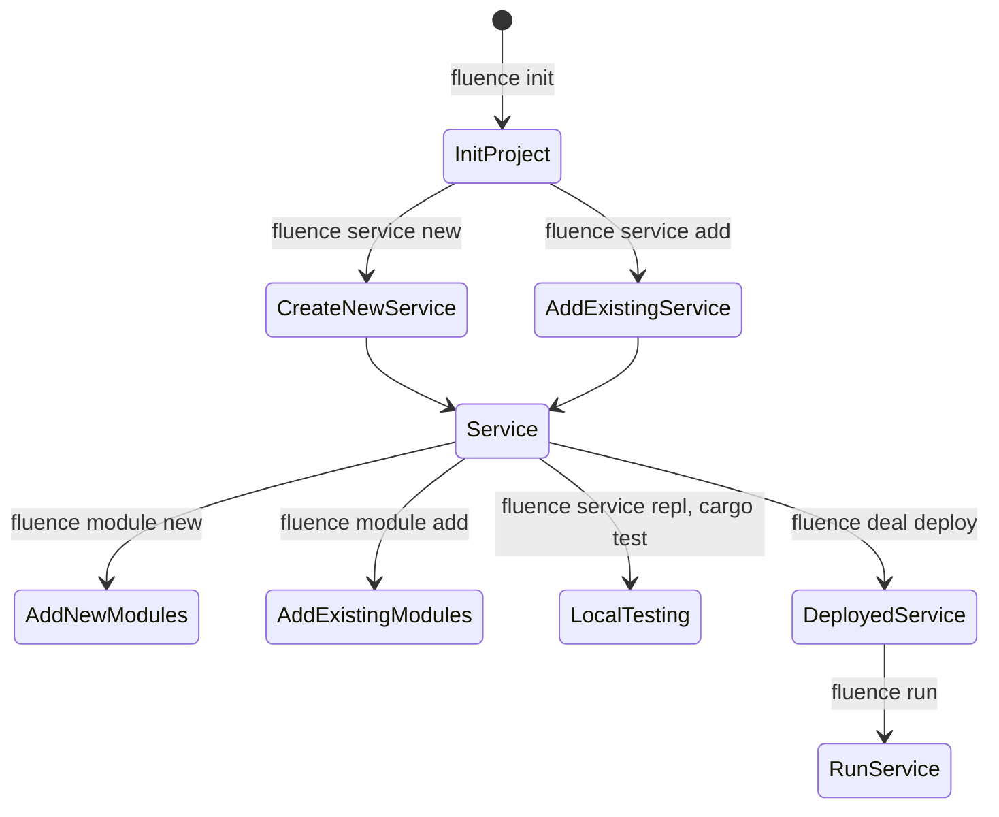
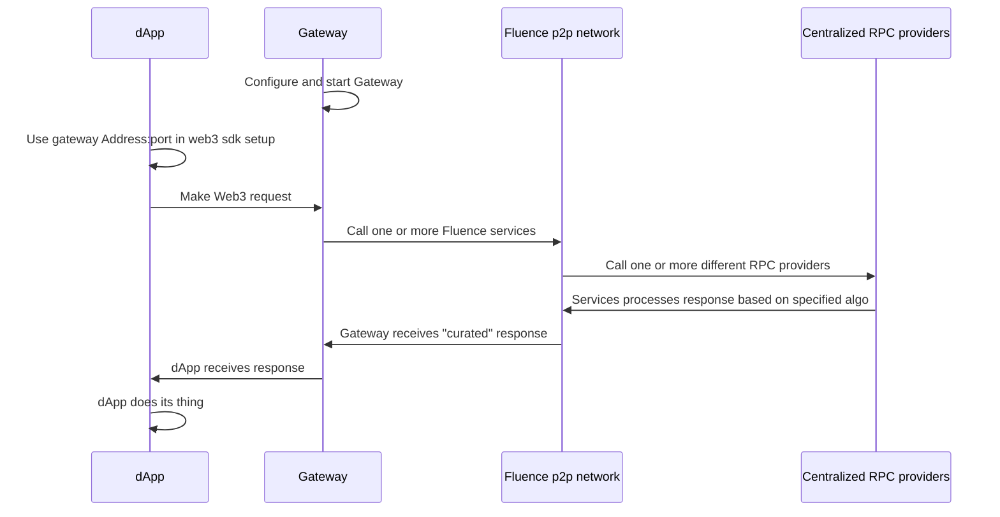
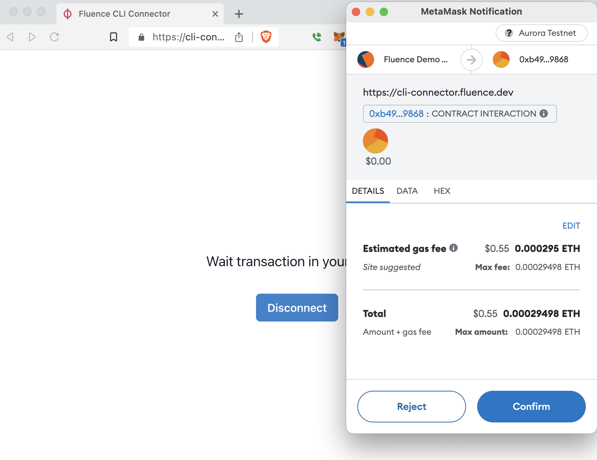

# Hacking Decentralized RPC with Fluence

WIP

## Overview

Running blockchain nodes to support your dApps' read and write requirements to/from a node tends to be rather resource intensive. Not surprisingly, Web3 developers have been flocking toward integrating their dApps with hosted blockchain JSON-RPC gateways. Alas, centralized "RPC as SaaS" introduces bottlenecks challenging the availability, reliability and Web3 ethos of dApps while quite often raising the exit barriers by providing custom API overlays to the EVM JSON-RPC API convention.

To accelerate dApp developers ability to utilize decentralized RPC in their dApps, Fluence is providing a decentralized RPC (fRPC) substrate, i.e., a starter kit that includes a gateway to bridge HTTP and Aqua, a Wasm service to connect to RPC endpoints and Aqua scripts implementing basic availability, failover and verification algorithms. See Figure 1.

Figure 1: Stylized fRPC Workflow With dAPP



fRPC substrate allows existing dApps to be upgraded to decentralized RPC while not requiring any changes to their frontend other than changing the HTTP transport url and making it easy to implement more complex control algorithms. Moreover, fRPC substrate components are highly customizable allowing developers to quickly and easily extend the substrate to fit their dApps' needs and to improve the fRPC ecosystem with improved services and algorithms. To this end, Fluence Labs is sponsoring fRPC themed hackathons throughout 2023.

Upcoming Fluence hackathons with fRPC bounties:

* [ETHDenver 2023](https://www.ethdenver.com/). See Fluence [events](https://www.notion.so/fluencenetwork/ETHDenver-Fluence-Team-66edb7a1a2624475844bfc11ff8c5756) and [bounty](https://github.com/fluencelabs/ethdenver-2023) repo for more info.

## Quickstart

Clone the repo, if you haven't done so already, and in the *gateway* directory, install the dependencies:

```bash
npm i
```

Before you proceed, you  should have, say, three RPC endpoint urls, e.g., Infura, Alchemy and QuickNode, for the same EVM-based chain you are using in your dAPP. Update the `configs/quickstart_config.json` by providing your endpoint urls and ignore the rest of the parameters for now:

```json
{
  "providers": [
    "<replace with your url_1/api-key>",   // <- replace
    "<replace with your url_2/api-key>",   // <- replace
    "<replace with your url_3/api-key>"    // <- replace and maybe add more
  ],
  "mode": "round-robin",
  "relay": "/dns4/stage.fluence.dev/tcp/19002/wss/p2p/12D3KooWMigkP4jkVyufq5JnDJL6nXvyjeaDNpRfEZqQhsG3sYCU",
  "serviceId": "e9e32b0b-3b19-4bdd-b1da-f5ff9cc0357f",
  "port": 3000,
  "counterServiceId": null,
  "counterPeerId": null,
  "quorumServiceId": null,
  "quorumPeerId": null,
  "quorumNumber": null
}
```

Now start the gateway:

```bash
npm run run configs/quickstart_config.json
> @fluencelabs/aqua-eth-gateway@0.0.11 run
> fluence aqua -i aqua/ -o aqua-compiled/ --js && node src/index.js configs/my_quickstart_config.json

# Compiling...
Result /Users/bebo/localdev/fRPC-Substrate/gateway/aqua-compiled/rpc.js: compilation OK (10 functions, 4 services)
Result /Users/bebo/localdev/fRPC-Substrate/gateway/aqua-compiled/rpc.d.ts: compilation OK (10 functions, 4 services)
Result /Users/bebo/localdev/fRPC-Substrate/gateway/aqua-compiled/rpc.js: compilation OK (10 functions, 4 services)
Result /Users/bebo/localdev/fRPC-Substrate/gateway/aqua-compiled/rpc.d.ts: compilation OK (10 functions, 4 services)

Running server...
Server was started on port 3000

```

With the gateway ready for action, all you have to do is change your dApps HTTP transport url to `http://127.0.0.1:3000` and keep using your dApp as usual. In the absence of a dAPP, we can interact with the gateway from the command line:

```bash
curl http://127.0.0.1:3000  \
    -X POST \
    -H "Content-Type: application/json" \
    -d '{"jsonrpc":"2.0","method":"eth_blockNumber","params": [],"id":100}'

{"jsonrpc":"2.0","id":100,"result":"0x82b950"

# with the corresponding gateway log output
Receiving request 'eth_blockNumber'
peerId: 12D3KooWKDnWpCLPJrycSevracdEgGznfDPwG1g5CWbt8uccdL79
Counter: 1
Worker used: "12D3KooWKPcNwR6EMq3sqm4sKtUKmZbMhPQ2dk1zr8YNgjdu9Xqn"
Call will be to : https://eth-goerli.g.alchemy.com/v2/<your api key>
```

Since we have specified *round-robin* in our config file and have more than one endpoint url in play, re-running the json-rpc call should result in a different endpoint selection:

```bash
curl http://127.0.0.1:3000  \
    -X POST \
    -H "Content-Type: application/json" \
    -d '{"jsonrpc":"2.0","method":"eth_blockNumber","params": [],"id":100}'

{"jsonrpc":"2.0","id":100,"result":"0x82b956"

# with the corresponding gateway log output

Receiving request 'eth_blockNumber'
peerId: 12D3KooWKDnWpCLPJrycSevracdEgGznfDPwG1g5CWbt8uccdL79
Counter: 2
Worker used: "12D3KooWKPcNwR6EMq3sqm4sKtUKmZbMhPQ2dk1zr8YNgjdu9Xqn"
Call will be to : https://frequent-sleek-river.ethereum-goerli.discover.quiknode.pro/<your api key>/

```

Success! Go ahead and replace the `round-robin` mode with the `random` mode in your config file, stop and start the gateway and have a look at the different endpoint management.

Congrat's, you just took a major step toward keeping you dAPP decentralized, available and performant! Now it's time to dive into the Fluence protocol and technology stack to learn how to improve upon the basic substrate and compete for hackathon bounties.

## Developing With Fluence

Fluence's decentralized serverless protocol and solution stack allows developers to quickly create decentralized applications and protocols by distributing services for subsequent execution to peers of the open and permissionless Fluence peer-to-peer compute network. Specifically, developers:

* express their business logic in Rust code compiled to wasm32-wasi
* create a [Deal](https://fluence.dev/docs/build/glossary#deal), i.e., a construct that links on-chain contract economics and off-chain resources necessary for peers to run a service, which entails escrowing stablecoin, currently limited to (testnet) USDC, to the Deal contract
* deploy their Wasm modules plus linking instructions as a uniquely addressable *service* to p2p network storage, i.e., IPFS

With a Deal in place, resource owners, i.e., owner/operators of one or more peer, make a decision whether to host the service and if so, participate in the Deal by providing a stake to the Deal contract and pulling the corresponding service assets required for hosting from IPFS. As a matter of fact, peers utilize [Workers](https://fluence.dev/docs/build/glossary#worker), omitted from Figure 2 for simplicity reasons, to implement their side of a Deal. See Figure 2.



While this sounds, and is, elaborate, *Fluence CLI*, see below, takes care of most of the scaffolding and workflow management for you.

**Note:** At this point, the marketplace for Fluence's decentralized serverless isn't quite finished. The supply side has not been enabled and on the demand side, parameters are fixed for the testnet. That is, developers are not able to provide custom Deal parameters, such as willingness to pay for service execution. Instead, these parameters, i.e. price of execution per epoch and epoch duration, are hard-coded and used by Fluence CLI to create the corresponding Deal contract and transaction for you to sign. Moreover, economics are limited to the testnet using testnet tokens and throughout the EthDenver hackathon, resource owners may not claim their periodic share of revenue from the Deal's escrow.

## Setting Up For Developing With Fluence

To get going, you need to install and setup a few dependencies.

> Note: Fluence tooling works on most *nix systems including OSX and Windows Linux Subsystem. At this time, Windows is not supported.

### Off-chain Dependencies

* [node](https://nodejs.org/en/) 16 LTS (versions 18.* and above are currently not supported)
* [Fluence CLI](https://github.com/fluencelabs/fluence-cli)
* [Rust](https://www.rust-lang.org/tools/install) (optional; Fluence CLI will install if not already in your environment)
* For VSCode, there is a helpful [Aqua language support](https://marketplace.visualstudio.com/items?itemName=FluenceLabs.aqua) package available

**Note** that Fluence CLI installs missing dependencies as neededs ("lazy install"). If you want all your dependencies installed at once, use the `fluence dependencies i` command.

### On-chain Dependencies

* Wallectconnect compatible wallet, e.g., MetaMask, setup for and funded with:
  * [Polygon](https://polygon.technology/) [Mumbai testnet](https://chainlist.org/?testnets=true&search=mumbai)
  * [MATIC testnet faucet](https://faucet.polygon.technology/) [or](https://mumbaifaucet.com/)
  * [Fluence USDC testnet faucet](https://faucet.fluence.dev/)

You will need  Mumbai (testnet) MATIC and Fluence (testnet) USDC. This is as good a time as any to head over to those faucets and get your allocations. As an experienced Web3 dev, you know it's safest to set up a new account, say, fRPC-dev, for the Mumbai testnet and testnet tokens.

### RPC Endpoints

Since fRPC works with existing centralized or self-hosted RPC providers, you want at least three provider urls with appended API keys to *the* chain of your choice. Multi-chain support is currently not supported by fRPC SUbstrate (hint, hint to all you hackathoners). For Ethereum's Goerli testnet, for example:

* Infura: https://goerli.infura.io/v3/<your key>
* Alchemy: https://eth-goerli.g.alchemy.com/v2/<your key>
* QuickNode: https://frequent-sleek-river.ethereum-goerli.discover.quiknode.pro/<your key>/

Each of the listed providers has a free account option and supports the API key in the url style, rather than the header, which is the current gateway implementation choice; a choice you should feel free to override and customize to your needs.

### Tools And Tooling

The most prominent developer's helper is [Fluence CLI](https://github.com/fluencelabs/fluence-cli), which allows you to manage the entire lifecycle of a project including Rust and Aqua code as well as Deals. From scaffolding your project, services and modules to deal creation and service deployment, Fluence CLI has you covered. Moreover, Fluence CLI can scaffold JS projects using [js-client](https://github.com/fluencelabs/js-client) allowing you to create, or integrate, Fluence projects for the browser or node app. See Figure 3 for a quick overview of workflows managed by Fluence CLI and the associated commands. If you have Fluence CLI installed, use `fluence --help` to get a more complete overview of topics and commands.

Figure 3: Stylized Project Creation And Deployment Workflow With Fluence CLI



See [FLuence CLI](https://github.com/fluencelabs/fluence-cli) for more details. For implementing your business logic with Rust and compiling it to wasm32-wasi, aka Wasm, module(s), see the [Marine book](https://fluence.dev/docs/marine-book/introduction). To learn more about distributed choreography and composition of services, see the [Aqua book](https://fluence.dev/docs/aqua-book/introduction).

## Hacking On fRPC Substrate

Fluence's *fRPC Substrate* is a starter kit that includes all the components you need to quickly enable your dAPP with decentralized RPC using existing centralized RPC providers, e.g., Infura, Alchemy, QuickNode, etc., without touching your existing frontend Web3 code. fRPC substrate consists of the following code components, see Figure 4:

* RPC API "adapter" code written in Rust and compiled to wasm32-wasi modules that are deployable to any peer in the Fluence p2p network
* Aqua code for distributed algorithms, such as Random and Round Robin selection, using the distributed Wasm connectors for request-response handling over libp2p
* A gateway app server that bridges libp2p transport to the HTTP transport expected by your dAPPs' Web3 SDK, such as web3js, ethers, etc. Note that the expectation at this point is for you to *self-host* the gateway at a location of your choosing.

Figure 4: Stylized fRPC Use With dAPPs



In order to use the fRPC substrate out-of-the-box or after customization, you need to:

* have three or more centralized RPC endpoints ready, where each provider url needs to contain the API key, e.g.,
* deploy a deal
* deploy the service
* update the gateway configuration
* run the gateway
* use the gateway url in your web3 sdk's HTTP transport config

### fRPC Wasm Components

fRPC Substrate comes with one *service* comprised of two Wasm modules, which you can find in the [wasm-modules]("./wasm-modules/") directory. The service is called 'eth_rpc' and the included modules are a [curl_adapater]("./../wasm-modules/curl-adapter") and ["eth_rpc]("./../wasm-modules/eth-rpc"). The *curl_adapter* module is a generic, re-usable module allowing access a peer's curl binary, if permissioned by the peer, and exposes the *curl_request* function. Any modules requiring curl access may use the curl_adapter modules via [FFI linking](https://doc.rust-lang.org/nomicon/ffi.html) with the *curl_request* function.

The *eth_rpc* module manages the json-rpc requests and responses initiated and consumed by Aqua scripts as he result of some frontend event, .e.g. our dAPP or curl request. Once available on peers of the Fluence p2p network, the *eth-rpc* services, aka RPC endpoint adapter, allows us to call one or more RPC endpoints using Aqua for choreography and composition of services.

Before you can deploy your service, use `fluence build` in the root dir to compile each module's Rust code to wasm32-wasi output:

```bash
fluence build
# Making sure all services are downloaded...
# Making sure all services are built...
    Finished release [optimized] target(s) in 0.61s
```

See [target dir]("./target/wasm32-wasi/release") for *curl_adapter.wasm* and *eth_erpc.wasm*, respectively. With the wasm modules available, you can locally interact with them using [Marine REPL](https://crates.io/crates/mrepl):

`fluence service repl`

```bash
fluence service repl
? Enter service name from fluence.yaml, path to a service or url to .tar.gz archive wasm-modules
# Making sure service and modules are downloaded and built...
    Finished release [optimized] target(s) in 0.18s

^^^^^^^^^^^^^^^^^^^^^^^^^^^^^^^^^^^^^^^^^^^^^^^^^^^^^^^^^^^^^^^^^^^^^^^^^^^^^^^^

Execute help inside repl to see available commands.
Current service <module_name> is: eth_rpc
Call eth_rpc service functions in repl like this:

call eth_rpc <function_name> [<arg1>, <arg2>]

^^^^^^^^^^^^^^^^^^^^^^^^^^^^^^^^^^^^^^^^^^^^^^^^^^^^^^^^^^^^^^^^^^^^^^^^^^^^^^^^

Welcome to the Marine REPL (version 0.19.1)
Minimal supported versions
  sdk: 0.6.0
  interface-types: 0.20.0

app service was created with service id = f0fc66d9-1fc6-494f-bcc1-104970875730
elapsed time 254.67135ms

1> i
Loaded modules interface:
exported data types (combined from all modules):
data MountedBinaryResult:
  ret_code: i32
  error: string
  stdout: []u8
  stderr: []u8
data U64Value:
  value: u64
  success: bool
  error: string
data BytesValue:
  value: []u8
  success: bool
  error: string
data JsonString:
  value: string
  success: bool
  error: string

exported functions:
curl_adapter:
  func curl_request(cmd: []string) -> MountedBinaryResult
eth_rpc:
  func block_number(uri: string) -> U64Value
  func call_get_accounts(uri: string) -> [][]u8
  func accounts(uri: string) -> []JsonString
  func call(uri: string, req: string, block: u64) -> BytesValue
  func eth_call(uri: string, method: string, json_args: []string) -> JsonString

2>call eth_rpc eth_call ["https://<your network>.infura.io/v3/<your api key>", "eth_blockNumber", []]
result: {
  "error": "",
  "success": true,
  "value": "\"0x82a08d\""
}
 elapsed time: 588.092888ms

3>
```

The *i* command lists all the exported interfaces from the wasm modules in Aqua instead of Rust notation. In *expoerted* functions you seee the module namespace, e.g., *curl_adapter* , and exported functions, e.g., *curl_request*. To execute a function, use `call <namespace> <function name> [<parameters>]`.

### Adding Modules To A Service

Regardless of your customization requirements, you probably will have no reason to modify the *curl_adapter* and *eth_rpc* modules. However, you may want to add new modules, or even services, to handle your additional business logic requirements. For example, you may want to capture RPC endpoint performance data, such as response times and availability, to some Web3 storage, e.g., IPFS or Ceramic, for further analysis to, say, derive a weighting scheme for endpoint selection. 

Fluence CLI allows you to quickly crate a new, or add an existing, module to your project. For example,

```bash
 fluence module new
? Enter module path wasm-modules/demo-module
Successfully generated template for new module at wasm-modules/demo-module
```

Which created a Rust project in the *wasm-module/demo-module* directory ready for you to customize. When you're done, you add the new module to your service config, service.yaml:

```bash
fluence module add
? Enter path to a module or url to .tar.gz archive wasm-modules/demo
? Enter service name from fluence.yaml or path to the service directory wasm-modules
Added demo to ~/localdev/fRPC-Substrate/wasm-modules/service.yaml
```

The demo module is now part of the service and  `fluence build`, for example, now compiles the *demo* module as part of the project build. You can create a new service with the `fluence service new` command. Note that the implication of creating a new service, possibly in a new project directory, is that you intend to deploy that service separately from the *eth-rpc* service. Of course, you will need to write Aqua code to be able to interact with your new module.

To get rid of the demo project for now, use `fluence module remove` to unlink the module from the *fluence.yaml* and *service.yaml* files; the old *rm -r <path/demo>* gets rid of the code template.

### Deploying A Service

With a service, in this case the *eth-rpc* service, ready for deployment, we simply use the `fluence deal deploy` command:

```bash
fluence deal deploy

# 1 compile assets
   Compiling proc-macro2 v1.0.51
   <...>
   Compiling web3 v0.18.0
   Compiling eth_rpc v0.1.0 (/Users/bebo/localdev/fRPC-demo/wasm-modules/eth-rpc)
    Finished release [optimized] target(s) in 28.32s

# 2 upload packaged assets
ipfs: did pin QmTvNwBeDop1yD9dLNjgrzfBMsgtrBmD859ahqQS1EWhbj to /dns4/ipfs.fluence.dev/tcp/5001
ipfs: file QmTvNwBeDop1yD9dLNjgrzfBMsgtrBmD859ahqQS1EWhbj pinned to /dns4/ipfs.fluence.dev/tcp/5001
ipfs: did pin QmWjbt6biEhsNEeDgspgHtwjwo7yS2asm7R7JjxnwMsupm to /dns4/ipfs.fluence.dev/tcp/5001
ipfs: file QmWjbt6biEhsNEeDgspgHtwjwo7yS2asm7R7JjxnwMsupm pinned to /dns4/ipfs.fluence.dev/tcp/5001
ipfs: did pin Qmb5ZTnkSBfzYdCfcVYUn7oBDTiVeoUX3oZvM7bRUhMPXZ to /dns4/ipfs.fluence.dev/tcp/5001
ipfs: file Qmb5ZTnkSBfzYdCfcVYUn7oBDTiVeoUX3oZvM7bRUhMPXZ pinned to /dns4/ipfs.fluence.dev/tcp/5001
ipfs: did pin QmP5nxY7nFdYw3PxUUbHe2yfHui9t2sGPpSeiSs1QNwFwK to /dns4/ipfs.fluence.dev/tcp/5001
ipfs: file QmP5nxY7nFdYw3PxUUbHe2yfHui9t2sGPpSeiSs1QNwFwK pinned to /dns4/ipfs.fluence.dev/tcp/5001
ipfs: did pin QmVsTtmsUF66raAdmCdbdvJXWZW69QoqJ2iMffvxaXHgAQ to /dns4/ipfs.fluence.dev/tcp/5001
ipfs: file QmVsTtmsUF66raAdmCdbdvJXWZW69QoqJ2iMffvxaXHgAQ pinned to /dns4/ipfs.fluence.dev/tcp/5001

# 3 process upload responses for local updates
log: [
  'deployed workers',
  [
    {
      definition: 'QmVsTtmsUF66raAdmCdbdvJXWZW69QoqJ2iMffvxaXHgAQ',
      installation_spells: [],
      name: 'defaultWorker'
    }
  ]
]

# 4 if Deal is already in place update or create new Deal?
? There is a previously deployed deal for worker defaultWorker on network testnet. Do you want to update this existing deal?
No

Creating deal for worker defaultWorker

# 5 request signing of escrow payment transaction
To approve transactions with your to your wallet using metamask, open the following url:

https://cli-connector.fluence.dev/?wc=6db18e37-90cc-4977-bee9-892676c1e218%401&bridge=https%3A%2F%2Fu.bridge.walletconnect.org&key=5d31de7d9c7f4cbe26032a1eaa4a7cbe5a55ed88df3073dfe5dd084cd5f80539

or go to https://cli-connector.fluence.dev and enter the following connection string there:

wc:6db18e37-90cc-4977-bee9-892676c1e218@1?bridge=https%3A%2F%2Fu.bridge.walletconnect.org&key=5d31de7d9c7f4cbe26032a1eaa4a7cbe5a55ed88df3073dfe5dd084cd5f80539

# 6 if escrow payment is processed, deal deployment is finalized
Deploy completed successfully
```

One little command is doing quite a bit so you don't have to. Let's work through the process:

* once we launch `fluence deal deploy` we create a (new) Deal with both on-chain and off-chain activities
* for an up-to-date look, all service assets, i.e., modules, are (re-) compiled (1)
* the wasm modules and config are uploaded to IPFS node where deal-participating peer's workers can fetch the package by CID (2)
* get back CID and update local file(s) (3)
* if a deal is already in place, which was so you could run the Quickstart demo *quickly*, either update existing deal or create a new one: create a new one ! (4)
* now you have to get involved! you are presented with the uri to get metamask to ask you to sign your escrow payment to the contract (5). Copy and paste the uri to your browser and eventually, Metamask should pop-up with a signing request. The transaction displays only in hex, so double check the other request params to make sure you're signing the Fluence Mumbai testnet transaction. This is what you should see:

* once you signed the transaction and the contract was successfully updated, we are done (6) !

Fluence CLI did a hole bunch of work for us behind the scenes and signing the transaction is a lot quicker than entering (virtual) credit card information. The parametric details necessary to write Aqua scripts are save in [deals.aqua](./.fluence/aqua/deals.aqua) and serves as an important dependency in your Aqua scripts, as we'll see in the next section.
### fRPC Algorithms

The fRPC substrate comes with basic implementations of several algorithms useful in mitigating failure as the result of availability and lack of trustlessness. You cna find these 

#### Round robin

```aqua
func roundRobin(uris: []string, method: string, jsonArgs: []string, serviceId: string, counterServiceId: string, counterPeerId: string, callFunc: string, string, []string, string -> JsonString) -> JsonString:
  on counterPeerId:
    Counter counterServiceId
    requestNumber <- Counter.incrementAndReturn()
  on INIT_PEER_ID:
    providerNumber = requestNumber % uris.length
    Logger.logCall(uris[providerNumber])
  <- callFunc(uris[providerNumber], method, jsonArgs, serviceId)
```

#### Failover


#### Quorum

```aqua
func quorum(uris: []string, quorumNumber: u32, timeout: u32, method: string, jsonArgs: []string, serviceId: string, quorumServiceId: string, quorumPeerId: string, 
    callFunc: string, string, []string, string -> JsonString) -> QuorumResult:
  results: *JsonString
  on INIT_PEER_ID:
    for uri <- uris par:
      results <- callFunc(uri, method, jsonArgs, serviceId)
  join results[uris.length - 1]
  par Peer.timeout(timeout, "") 
  on quorumPeerId:
    Counter quorumServiceId
    quorumResult <- QuorumChecker.check(results, quorumNumber)
  <- quorumResult
```

#### Subnet

```aqua
func withSubnets(uris: []string, method: string, jsonArgs: []string) -> JsonString:
  workersInfo <- getWorkersInfo()
  dealId = workersInfo.defaultWorker.dealId    
  on HOST_PEER_ID:
    workersOp <- resolveSubnetwork(dealId)
    workers = workersOp!
    workersNum = workers.length
    -- choose worker randomly
    timeW <- NumOp.identity(Peer.timestamp_sec())
    workerNumber = timeW % workers.length
    worker = workers[workerNumber] 
    on worker.metadata.peer_id via worker.metadata.relay_id:
      -- choose provider randomly
      timeP <- NumOp.identity(Peer.timestamp_sec())
      providerNumber = timeW % uris.length
      result <- EthRpc.eth_call(uris[providerNumber], method, jsonArgs)
  Logger.logWorker(worker)
  Logger.logCall(uris[providerNumber])
  <- result
```
  
### Deploy <Deal, Worker, Service> ?

#### fluence deal deploy


```bash
fluence deal deploy
   Compiling curl_adapter v0.1.0 (/Users/bebo/localdev/fRPC-Substrate/wasm-modules/curl-adapter)
    Finished release [optimized] target(s) in 1.48s
ipfs: did pin QmTvNwBeDop1yD9dLNjgrzfBMsgtrBmD859ahqQS1EWhbj to /dns4/ipfs.fluence.dev/tcp/5001
ipfs: file QmTvNwBeDop1yD9dLNjgrzfBMsgtrBmD859ahqQS1EWhbj pinned to /dns4/ipfs.fluence.dev/tcp/5001
ipfs: did pin QmWjbt6biEhsNEeDgspgHtwjwo7yS2asm7R7JjxnwMsupm to /dns4/ipfs.fluence.dev/tcp/5001
ipfs: file QmWjbt6biEhsNEeDgspgHtwjwo7yS2asm7R7JjxnwMsupm pinned to /dns4/ipfs.fluence.dev/tcp/5001
ipfs: did pin QmbHt422MnruToQvjMiHYLmQUwy4tejqm3JJMytCtsktUd to /dns4/ipfs.fluence.dev/tcp/5001
ipfs: file QmbHt422MnruToQvjMiHYLmQUwy4tejqm3JJMytCtsktUd pinned to /dns4/ipfs.fluence.dev/tcp/5001
ipfs: did pin QmP5nxY7nFdYw3PxUUbHe2yfHui9t2sGPpSeiSs1QNwFwK to /dns4/ipfs.fluence.dev/tcp/5001
ipfs: file QmP5nxY7nFdYw3PxUUbHe2yfHui9t2sGPpSeiSs1QNwFwK pinned to /dns4/ipfs.fluence.dev/tcp/5001
ipfs: did pin Qmc1XgSk5gB3pYd3oEY6t3tAZPAYUsptuCZgEFqsTcoBq2 to /dns4/ipfs.fluence.dev/tcp/5001
ipfs: file Qmc1XgSk5gB3pYd3oEY6t3tAZPAYUsptuCZgEFqsTcoBq2 pinned to /dns4/ipfs.fluence.dev/tcp/5001
log: [
  'deployed workers',
  [
    {
      definition: 'Qmc1XgSk5gB3pYd3oEY6t3tAZPAYUsptuCZgEFqsTcoBq2',
      installation_spells: [],
      name: 'defaultWorker'
    }
  ]
]
? There is a previously deployed deal for worker defaultWorker on network testnet. Do you want to update this existing deal? Yes

Updating deal for worker defaultWorker

To approve transactions with your to your wallet using metamask, open the following url:

https://cli-connector.fluence.dev/?wc=464a007e-1102-46cb-9ffc-6243ef84b4db%401&bridge=https%3A%2F%2Fp.bridge.walletconnect.org&key=b6da0eae424d7c68fe32c6fadc8e372bee81e8162613e58ae6be0385c766b7bf

or go to https://cli-connector.fluence.dev and enter the following connection string there:

wc:464a007e-1102-46cb-9ffc-6243ef84b4db@1?bridge=https%3A%2F%2Fp.bridge.walletconnect.org&key=b6da0eae424d7c68fe32c6fadc8e372bee81e8162613e58ae6be0385c766b7bf

Deploy completed successfully
```

Screen Shot 2023-02-25 at 4.58.20 PM.png

#### fluence workers deploy


#### fluence legacy deploy

### Configuring And Running the Gateway

As mentioned earlier, you can download the nom package and run it. Alteratively, change into the *gateway* dir and build from source:

```bash
npm i
```

to install the required node modules. Now you are ready to start the gateway with:

```bash
npm run run <path to your configuration file>
```

where the config file takes the form of:

```json
{
  "providers": [
    <provider_url/<api key>>
  ],
  "mode": "subnet",
  "relay": "/dns4/stage.fluence.dev/tcp/19001/wss/p2p/12D3KooWHCJbJKGDfCgHSoCuK9q4STyRnVveqLoXAPBbXHTZx9Cv",
  "serviceId": "25bf2293-7503-4a01-af00-d1b7d089ca37",
  "port": 3000,
  "counterServiceId": null,
  "counterPeerId": null,
  "quorumServiceId": null,
  "quorumPeerId": null,
  "quorumNumber": 2
}
```

and

* `counterServiceId` and `counterPeerId` is credentials to counter service for `round-robin` mode. Will be used local counter if undefined
* `quorumServiceId` and `quorumPeerId` is credentials to counter service for `round-robin` mode. Will be used local counter if undefined
* `quorumNumber`, `2`, is the minimum number of "equal" responses required to accept and pass on a response from multi-request query
* mode:
  * `random` - choose providers randomly
  * `round-robin` - choose providers in circle order
  * `quorum` - call all providers specified and choose the result that is the same for `>= quorumNumber` providers or return an error.
  * `subnet` - use a pre-deployed subnet, choose worker and provider randomly

### Customizing And Extending fRPC

We identified two major issues with centralized RPC: availability and verifiability.

∑


===============================================================================================================
#### Distributed RPC API Adapters With Marine

In the "./wasm-modules/" directory, you find two modules: *curl_adapter* and *eth-rpc*, each comprised of the Rust code and a configuration file called *module.yaml*, which are referenced in the top directory's *service.yaml* file. Now, what are those modules good for?

#### Curl Adapter

Wasm modules are socket-less, single-threaded entities confined to a sandbox keeping the host safe. However, Marine modules come with a configuration file that not only allows a module to "punch through" the sandbox and have access to a host's resources but also for a host to permission such access. No permission from the host, no access. This information is contained in the *module.yaml*:

```yaml
version: 0
type: rust
name: curl_adapter
mountedBinaries:
  curl: /usr/bin/curl
```

Which basically states that the Wasm module named *curl_adapter* wants access to a binary callable with the (host) path `/usr/bin/curl`. Looking at the the *main.rs* file:

```Rust
use marine_rs_sdk::{marine, MountedBinaryResult};

pub fn main() {}

#[marine]
pub fn curl_request(cmd: Vec<String>) -> MountedBinaryResult {
    curl(cmd)
}

#[marine]
#[link(wasm_import_module = "host")]
extern "C" {
    fn curl(cmd: Vec<String>) -> MountedBinaryResult;
}
```

In order to make access to the host's binary happen, we use Rust's FFI interface to link a function names *curl*, taking an array of strings as its argument, and expose it to the module via the `#[marine]` macro. We then wrap the *curl* function with the *curl_request* function for the whole purpose to expose it, via the `#[marine]` macro, as the sole exported function. Why? so any other Wasm module in need of curl access can link to the *curl_adapter* and utilize the *curl_request* function to make *curl* calls including out *eth-rpc* module.

#### ETH RPC Module

The *eth_rpc* module uses [Web3](https://crates.io/crates/web3), a Rust EVM json-rpc client.

```Rust

```

TODO: need to clean up code.

For all things Wasm, see the [Marine book](https://fluence.dev/docs/marine-book/introduction) and the Fluence [developer documentation](TBD). Also note, that unless you need some EVM method not currently made available or customize special RPC provider interaction, you may not have to touch this module and the service.


#### Deploying The Service

Even if you don't change the Rust code, you still need to deploy the service to one or more peers to be usable by you dAPP via the gateway. 

#### Distributed Workflow Orchestration With Aqua

soon

#### Bridging P2P and HTTP With The Gateway

soon

### Running fRPC Substrate

soon
