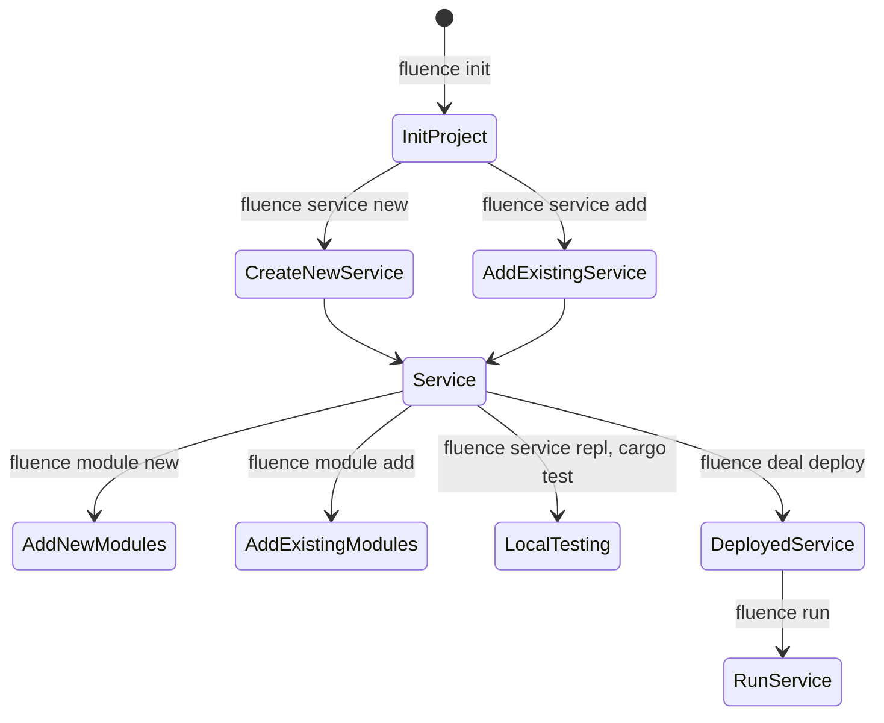
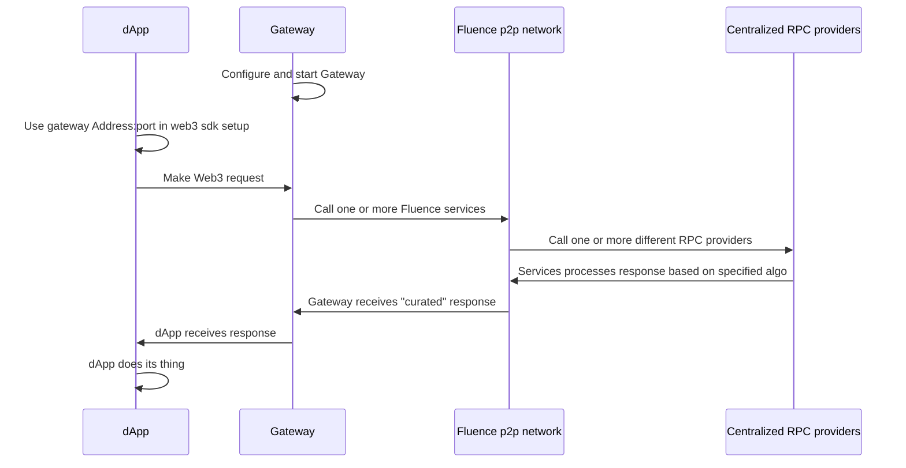

# Hacking Decentralized RPC with Fluence

**WIP*

## Overview

Running blockchain nodes to support your dApps read and write requirements to/from a node tends to be rather resource intensive. Not surprisingly, Web3 developers have been flocking toward integrating their dApps with hosted blockchain JSON-RPC gateways. Alas, centralized "RPC as SaaS" introduces bottlenecks challenging the availability, reliability and Web3 ethos of dApps while quite often raising the exit barriers by providing custom API overlays to the EVM JSON-RPC API convention. 

To accelerate dApp developers ability to utilize decentralized RPC in their dApps, Fluence is providing a decentralized RPC (fRPC) substrate, i.e., a starter kit that allows existing dApps to be upgraded to decentralized RPC while not requiring any changes on their front end other than changing the HTTP transport url.

Upcoming Fluence hackathons with fRPC bounties:

* [ETHDenver 2023](https://www.ethdenver.com/). See Fluence [events](https://www.notion.so/fluencenetwork/ETHDenver-Fluence-Team-66edb7a1a2624475844bfc11ff8c5756) and [bounty](https://github.com/fluencelabs/ethdenver-2023) repo for more info.

## Developing With Fluence

Fluence's decentralized serverless protocol and solution stack allows developers to quickly create decentralized applications and protocols services distributed to peers of the open and permissionless Fluence peer-to-peer compute network. Specifically, developers express their business logic in Rust code, compile it to wasm32-wasi and deploy those modules + linking instructions as a uniquely addressable *service* to p2p network storage, i.e., IPFS, from where peers willing to participate in the Deal, i.e., willing to host the service for the remuneration published in the Deal contract, can pull the service assets required for hosting. In order for developers to get their services hosted and executed, they need to escrow stablecoin, currently limited to (testnet) USDC, to the Deal contract.

The Fluence protocol uses the concept of a [Deal](https://fluence.dev/docs/build/glossary#deal) to implement the economics and to bridge on- and off-chain state. A Deal describes a service(s), the service's "owner, e.g., developer, availability requirements, e.g., make the service available on, say, five peers, and other metadata and commits that data plus an escrow payment from the "owner" in an on-chain contract. Resource owners, i.e., actors who own/operate one or more peers, interested in participating in a deal also join the deal with a stake. See Figure 1.


While this sounds, and is, elaborate, *Fluence CLI*, see below, takes care of most of the process management for you.

At this point, the marketplace for deals isn't quite finished. Instead developers being able to to provide custom Deal parameters, such as willignness to pay for a service hosted, Fluence hard-coded a set of parameters, i.e. price of execution per epoch and epoch duration, which are used by Fluence CLI to create the corresponding Deal contract and transaction for you to sign. Moreover, economics are limited to the testnet using testnet tokens and throughout the EthDenver hackathon, resource owners may not claim their periodic share of revenue from the Deal's escrow.

If you are not familiar with Fluence terminology or just need a quick reminder, see the [Glossary](https://fluence.dev/docs/build/glossary) or [documentation](TBD).

## Setting Up For Developing With Fluence

To get going, you need install and setup a few dependencies outlined below.

### Off-chain Dependencies

* [node](https://nodejs.org/en/) 16 LTS (versions 18.* and 19.* are currently not supported)
* [Fluence CLI](https://github.com/fluencelabs/fluence-cli)
* [Rust](https://www.rust-lang.org/tools/install) (optional; Fluence CLI will install if not already in your environment)
* For VSCode, there is a helpful [Aqua language support](https://marketplace.visualstudio.com/items?itemName=FluenceLabs.aqua) package available

Note that Fluence CLI installs missing dependencies as need ("lazy install"). If you want all your dependencies installed at once, use the `fluence dependencies i`.

### On-chain Dependencies

* Wallectconnect compatible wallet, e.g., MetaMask, setup for and funded with:
  * [Polygon](https://polygon.technology/) [Mumbai testnet](https://chainlist.org/?testnets=true&search=mumbai)
  * [MATIC testnet faucet](https://faucet.polygon.technology/) [or](https://mumbaifaucet.com/)
  * [Fluence USDC testnet faucet](https://faucet.fluence.dev/)

### API Keys

Since fRPC works with existing RPC providers, you want at least three provider urls/API keys to *the* chain of your choice. Yes, multi-chain support is currently not supported by fRPC but for you to implement. For Ethereum's Goerli testnet, for example:

* Infura: https://goerli.infura.io/v3/<your key>
* Alchemy: https://eth-goerli.g.alchemy.com/v2/<your key>
* QuickNode: https://frequent-sleek-river.ethereum-goerli.discover.quiknode.pro/<your key>/

All three of the listed providers have a free account option and support the API key in the url, rather than the header, which is the current gateway implementation choice; a choice you should feel free to override and customize to your needs.

### Tools And Tooling

The most prominent developer's helper is [Fluence CLI](https://github.com/fluencelabs/fluence-cli), which allows you to manage the entire lifecycle of a project including Rust and Aqua code as well as Deals. From scaffolding your project, services and modules to deal creation and service deployment, Fluence CLI has you covered. Moreover, Fluence CLI can scaffold JS projects using [js-client](https://github.com/fluencelabs/js-client) allowing you to create, or integrate, Fluence projects for the browser or node app. See Figure 2 for a quick overview of workflows managed by Fluence CLI and the associated commands. If you have Fluence CLI installed, use `fluence --help` to get a more complete overview of topics and commands.

Figure 2: Stylized Project Creation And Deployment Workflow With Fluence CLI



See [FLuence CLI](https://github.com/fluencelabs/fluence-cli) for more details.

For implementing your business logic with Rust and compile to wasm32-wasi, aka Wasm, module(s), see the [Marine book](https://fluence.dev/docs/marine-book/introduction). To learn more about distributed choreography and composition of services, see the [Aqua book](https://fluence.dev/docs/aqua-book/introduction).

## Hacking On fRPC Substrate

Fluence's *fRPC Substrate* is a starter kit comprising all the components you need to quickly enable your dAPP with decentralized RPC using existing centralized RPC providers, e.g., Infura, Alchemy, QuickNode, etc., without touching your existing frontend Web3 code. fRPC substrate consists of the following code components, see Figure 2:

* RPC API adapter code written in Rust and compiled to wasm32-wasi modules that are deployable to any peer in the Fluence p2p network
* Aqua code for distributed algorithms, such as Round Robin, Failover and Quorum, using the distributed Wasm connectors for request-response handling over libp2p
* A gateway app server that bridges libp2p transport to the HTTP transport expected by your dAPPs' Web3 SDK, such as web3js, ethers, etc. Note that the expectation at this point is for you to *self-host* the gateway locally or in the cloud.

Figure 3: Stylized fRPC Use With dAPPs



In order to use the fRPC substrate out-of-the-box or after customization, you need to:

* have three or more centralized RPC endpoints ready, where each provider url needs to contain the API key, e.g.,
* deploy a deal
* deploy the service
* update the gateway configuration
* run the gateway
* use the gateway url in your web3 sdk's HTTP transport config

### On Services And Algorithms

fRPC Substrate comes with one service comprised of two modules, which you cna find in the [wasm-modules]("./wasm-modules/") directory. The service is called 'eth_rpc' and the included modules are a [curl_adpater]("./../wasm-modules/curl-adapter") and ["eth_rpc]("./../wasm-modules/eth-rpc"). The *curl_apadter* modules is a generic module allowing access a peer's curl binary, if permissioned by the peer, and exposes the *curl_request* function. Any modules requiring curl access may use the curl_adapter modules via [FFI linking]() and make curl calls with the *curl_request* function.

The *eth_rpc* module ...

For all things Wasm, see the [Marine book](https://fluence.dev/docs/marine-book/introduction)

Our *eth-rpc* service, once available on peers of the Fluence p2p network, essentially allows us to call one or more RPC endpoints using Aqua for choreograpy and composition of services. 


### Algorithms Already Implemented

The fRPC substrate comes with basic implementations of several algorithms useful in mitigating failure as the result of availability and lack of trustlessness. You cna find these 

#### Round robin


#### Failover


#### Quorum


#### Subnet
  
### Deploy <Deal, Worker, Service> ?

#### fluence deal deploy


```bash
luence deal deploy
   Compiling curl_adapter v0.1.0 (/Users/bebo/localdev/fRPC-Substrate/wasm-modules/curl-adapter)
    Finished release [optimized] target(s) in 1.48s
ipfs: did pin QmTvNwBeDop1yD9dLNjgrzfBMsgtrBmD859ahqQS1EWhbj to /dns4/ipfs.fluence.dev/tcp/5001
ipfs: file QmTvNwBeDop1yD9dLNjgrzfBMsgtrBmD859ahqQS1EWhbj pinned to /dns4/ipfs.fluence.dev/tcp/5001
ipfs: did pin QmWjbt6biEhsNEeDgspgHtwjwo7yS2asm7R7JjxnwMsupm to /dns4/ipfs.fluence.dev/tcp/5001
ipfs: file QmWjbt6biEhsNEeDgspgHtwjwo7yS2asm7R7JjxnwMsupm pinned to /dns4/ipfs.fluence.dev/tcp/5001
ipfs: did pin QmbHt422MnruToQvjMiHYLmQUwy4tejqm3JJMytCtsktUd to /dns4/ipfs.fluence.dev/tcp/5001
ipfs: file QmbHt422MnruToQvjMiHYLmQUwy4tejqm3JJMytCtsktUd pinned to /dns4/ipfs.fluence.dev/tcp/5001
ipfs: did pin QmP5nxY7nFdYw3PxUUbHe2yfHui9t2sGPpSeiSs1QNwFwK to /dns4/ipfs.fluence.dev/tcp/5001
ipfs: file QmP5nxY7nFdYw3PxUUbHe2yfHui9t2sGPpSeiSs1QNwFwK pinned to /dns4/ipfs.fluence.dev/tcp/5001
ipfs: did pin Qmc1XgSk5gB3pYd3oEY6t3tAZPAYUsptuCZgEFqsTcoBq2 to /dns4/ipfs.fluence.dev/tcp/5001
ipfs: file Qmc1XgSk5gB3pYd3oEY6t3tAZPAYUsptuCZgEFqsTcoBq2 pinned to /dns4/ipfs.fluence.dev/tcp/5001
log: [
  'deployed workers',
  [
    {
      definition: 'Qmc1XgSk5gB3pYd3oEY6t3tAZPAYUsptuCZgEFqsTcoBq2',
      installation_spells: [],
      name: 'defaultWorker'
    }
  ]
]
? There is a previously deployed deal for worker defaultWorker on network testnet. Do you want to update this existing deal? Yes

Updating deal for worker defaultWorker

To approve transactions with your to your wallet using metamask, open the following url:

https://cli-connector.fluence.dev/?wc=464a007e-1102-46cb-9ffc-6243ef84b4db%401&bridge=https%3A%2F%2Fp.bridge.walletconnect.org&key=b6da0eae424d7c68fe32c6fadc8e372bee81e8162613e58ae6be0385c766b7bf

or go to https://cli-connector.fluence.dev and enter the following connection string there:

wc:464a007e-1102-46cb-9ffc-6243ef84b4db@1?bridge=https%3A%2F%2Fp.bridge.walletconnect.org&key=b6da0eae424d7c68fe32c6fadc8e372bee81e8162613e58ae6be0385c766b7bf

Deploy completed successfully
```

Screen Shot 2023-02-25 at 4.58.20 PM.png

#### fluence workers deploy


#### fluence legacy deploy

### Configuring And Running the Gateway

As mentioned earlier, you can download the nom package and run it. Alteratively, change into the *gateway* dir and build from source:

```bash
npm i
```

to install the required node modules. Now you are ready to start the gateway with:

```bash
npm run run <path to your configuration file>
```

where the config file takes the form of:

```json
{
  "providers": [
    <provider_url/<api key>>
  ],
  "mode": "subnet",
  "relay": "/dns4/stage.fluence.dev/tcp/19001/wss/p2p/12D3KooWHCJbJKGDfCgHSoCuK9q4STyRnVveqLoXAPBbXHTZx9Cv",
  "serviceId": "25bf2293-7503-4a01-af00-d1b7d089ca37",
  "port": 3000,
  "counterServiceId": null,
  "counterPeerId": null,
  "quorumServiceId": null,
  "quorumPeerId": null,
  "quorumNumber": 2
}
```

and

* `counterServiceId` and `counterPeerId` is credentials to counter service for `round-robin` mode. Will be used local counter if undefined
* `quorumServiceId` and `quorumPeerId` is credentials to counter service for `round-robin` mode. Will be used local counter if undefined
* `quorumNumber`, `2`, is the minimum number of "equal" responses required to accept and pass on a response from multi-request query
* mode:
  * `random` - choose providers randomly
  * `round-robin` - choose providers in circle order
  * `quorum` - call all providers specified and choose the result that is the same for `>= quorumNumber` providers or return an error.
  * `subnet` - use a pre-deployed subnet, choose worker and provider randomly


### Customizing And Extending fRPC

We identified two major issues with centralized RPC: single point of failure and lack of trustlessness


Currenlty ...


#### Eliminating 


===============================================================================================================
#### Distributed RPC API Adapters With Marine

In the "./wasm-modules/" directory, you find two modules: *curl_adapter* and *eth-rpc*, each comprised of the Rust code and a configuration file called *module.yaml*, which are referenced in the top directory's *service.yaml* file. Now, what are those modules good for?

#### Curl Adapter

Wasm modules are socket-less, single-threaded entities confined to a sandbox keeping the host safe. However, Marine modules come with a configuration file that not only allows a module to "punch through" the sandbox and have access to a host's resources but also for a host to permission such access. No permission from the host, no access. This information is contained in the *module.yaml*:

```yaml
version: 0
type: rust
name: curl_adapter
mountedBinaries:
  curl: /usr/bin/curl
```

Which basically states that the Wasm module named *curl_adapter* wants access to a binary callable with the (host) path `/usr/bin/curl`. Looking at the the *main.rs* file:

```Rust
use marine_rs_sdk::{marine, MountedBinaryResult};

pub fn main() {}

#[marine]
pub fn curl_request(cmd: Vec<String>) -> MountedBinaryResult {
    curl(cmd)
}

#[marine]
#[link(wasm_import_module = "host")]
extern "C" {
    fn curl(cmd: Vec<String>) -> MountedBinaryResult;
}
```

In order to make access to the host's binary happen, we use Rust's FFI interface to link a function names *curl*, taking an array of strings as its argument, and expose it to the module via the `#[marine]` macro. We then wrap the *curl* function with the *curl_request* function for the whole purpose to expose it, via the `#[marine]` macro, as the sole exported function. Why? so any other Wasm module in need of curl access can link to the *curl_adapter* and utilize the *curl_request* function to make *curl* calls including out *eth-rpc* module.

#### ETH RPC Module

The *eth_rpc* module uses [Web3](https://crates.io/crates/web3), a Rust EVM json-rpc client.

```Rust

```

TODO: need to clean up code.

For all things Wasm, see the [Marine book](https://fluence.dev/docs/marine-book/introduction) and the Fluence [developer documentation](TBD). Also note, that unless you need some EVM method not currently made available or customize special RPC provider interaction, you may not have to touch this module and the service.


#### Deploying The Service

Even if you don't change the Rust code, you still need to deploy the service to one or more peers to be usable by you dAPP via the gateway. 

#### Distributed Workflow Orchestration With Aqua

soon

#### Bridging P2P and HTTP With The Gateway

soon

### Running fRPC Substrate

soon
