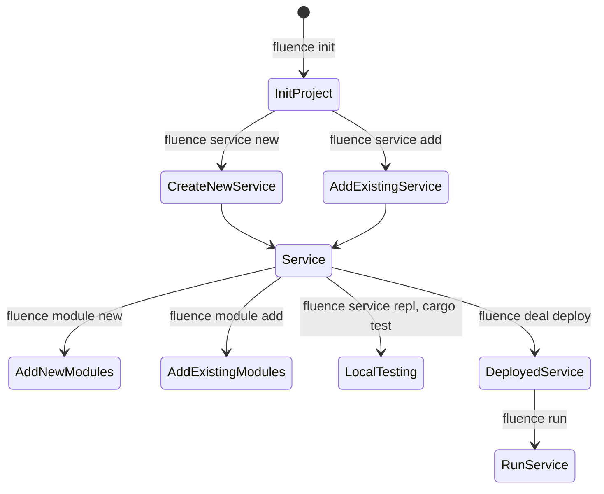
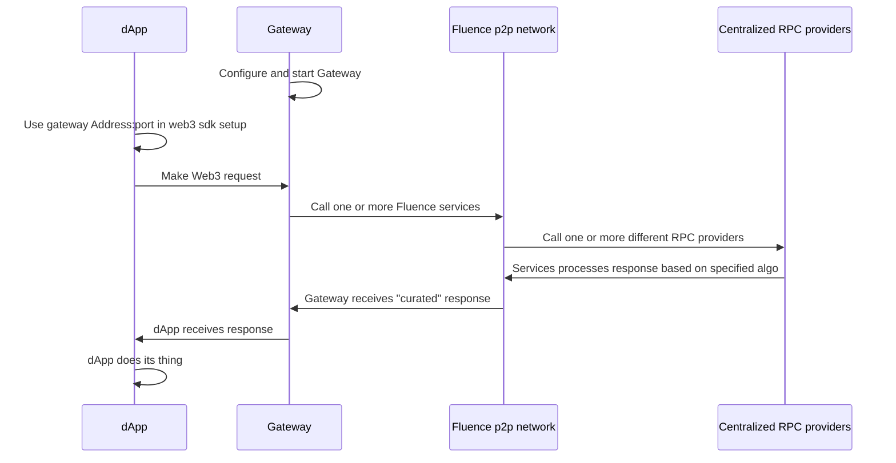

# Hacking Decentralized RPC with Fluence

**WIP*

## Overview

Running blockchain nodes to support your dApps read to and write from chain needs tends to be rather resource intensive and not surprisingly, Web3 developers tend to gravitate toward integrating their dApps with hosted blockchain JSON-RPC gateways. Alas, "RPC as SaaS" introduces centralized bottlenecks challenging the availability, reliability and Web3 ethos of dApps while quite often raising the exit barriers by providing custom API overlays to the EVM JSON-RPC convention. To accelerate dApp developers opportunity to utilize decentralized RPC, Fluence is providing a decentralized RPC (fRPC) substrate.

Fluence's decentralized serverless stack allows developers to quickly create decentralized applications and protocols from their own or third-party services distributed over a peer-to-peer network. Specifically, developers express their business logic in Rust code, compile it to wasm32-wasi and deploy those modules + linking instructions as a *service* to network peers willing to host the service. In order for developers to get their services hosted and executed, they need to pay hosting peers in stablecoin such as USDC.

The Fluence protocol uses the concept of a [Deal](https://fluence.dev/docs/build/glossary#deal) to bridge on- and off-chain relationships. Deals describe the developer's services and the necessary hosting providers resources to execute the developer's requirements, aka job. Deal creation, and developers' financial commitment toward a created Deal, is a critical step preceding the deployment of services to peers and is easily created with Fluence and popular Web3 tooling.

At this point, all economics are at the testnet level using testnet tokens. Moreover, the marketplace for deals isn't quite finished. Instead of using the Fluence marketplace to create and negotiate your deals, Fluence hardcoded a set of parameters, i.e. price of execution per epoch and epoch duration, which is used by Fluence CLI to create the corresponding transaction for you to sign with your wallet, e.g., MetaMask.

The idea behind fRPC is to give you a basic code base to accelerate your journey toward adding decentralized RPC to your dAPP. *fRPC is not a production ready product*, far from; instead, it is a playground intended for you to customize and extend to suit your dAPPs' needs. In fact, we are offering hackathons to further incentivize you to experiment and *buidl*.

Upcoming Fluence hackathons with fRPC bounties:

* [ETHDenver 2023](https://www.ethdenver.com/) and also see the Fluence [event and bounty](https://github.com/fluencelabs/ethdenver-2023) repo

## Setting Up

To get going, you need installa nd setup a few dependencies outlined below.

### Off-chain Dependencies

* [node](https://nodejs.org/en/) 16 LTS (versions 18.* and 19.* are currently not supported)
* [Fluence CLI](https://github.com/fluencelabs/fluence-cli)
* [Rust](https://www.rust-lang.org/tools/install) (optional; Fluence CLI will install if not already in your environment)
* For VSCode, there is a helpful [Aqua language support](https://marketplace.visualstudio.com/items?itemName=FluenceLabs.aqua) package available

### On-chain Dependencies

* Wallectconnect compatible wallet, e.g., MetaMask, setup for and funded with:
  * [Polygon](https://polygon.technology/) Mumbai testnet: https://chainlist.org/?testnets=true&search=mumbai
  * MATIC testnet faucet: https://faucet.polygon.technology/ or https://mumbaifaucet.com/
  * Fluence USDC testnet faucet: https://faucet.fluence.dev/

### API Keys

Since fRPC works with existing RPC providers, you want at least three provider urls and API keys to the EVM of your choice. For example for Ethereum's Goerli testnet:

* Infura: https://goerli.infura.io/v3/<your key>
* Alchemy: https://eth-goerli.g.alchemy.com/v2/<your key>
* QuickNode: https://frequent-sleek-river.ethereum-goerli.discover.quiknode.pro/<your key>/

All three of the listed providers have a free account option and support the API key in the url, rather than the header, which is the current gateway implementation choice; a choice you should feel free to override and customize to your needs.

## Tools And Tooling

The most prominent developer tool is [Fluence CLI](https://github.com/fluencelabs/fluence-cli), which allows you to manage the entire lifecycle of a project including Rust and Aqua code as well as Deals. From scaffolding your project, services and modules to deal creation and service deployment, Fluence CLI has you covered. Moreover, Fluence CLI can scaffold JS projects using [js-client[(https://github.com/fluencelabs/js-client) allowing you to create, or integrate, Fluence projects for the browser or node app. See Figure 1 for a quick overview of workflows managed by Fluence CLI and the associated commands. If you have Fluence CLI installed, use `fluence --help` to get a more complete overview of topics and commands.  

Figure 1: Stylized Project Creation And Deployment Workflow With Fluence CLI

If you are not familiar with Fluence terminology or just need a quick reminder, see the [Glossary](https://fluence.dev/docs/build/glossary) or [documentation](TBD).

## fRPC Substrate

Fluence's *fRPC Substrate* is a starter kit comprising all the components you need to quickly enable you to enable your dAPPs with decentralized RPC using existing centralized RPC providers, e.g., Infura, Alchemy, QuickNode, etc. The substrate consists of the following code components:

* RPC API adapter code written in Rust and compiled to wasm32-wasi that are deployable to any peer in the FLuence p2p network
* Aqua code for distributed algorithms, such as Round Robin, Failover and Quorum, using the distributed Wasm connectors for request-response handling over libp2p
* A gateway app server that bridges libp2p transport to the HTTP transport expected by your dAPPs' Web3 SDK, such as web3js, ethers, etc. Note that the expectation at this point is for you to *self-host* the gateway locally or in the cloud.

See Figure 2 for an end-to-end workflow representation of your dAPP with fRPC.

Figure 2: Stylized fRPC Use With dAPPs

### Working With fRPC Substrate

soon

#### Distributed RPC API Adapters With Marine

soon

#### Distributed Workflow Orchestration With Aqua

soon

#### Bridging P2P and HTTP With The Gateway

soon

### Running fRPC Substrate

soon
